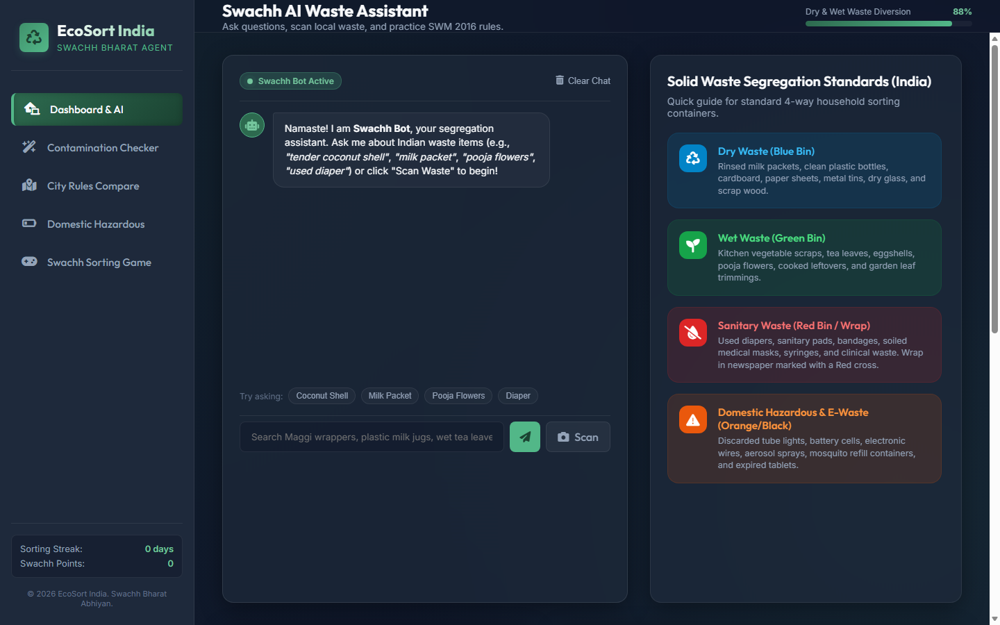
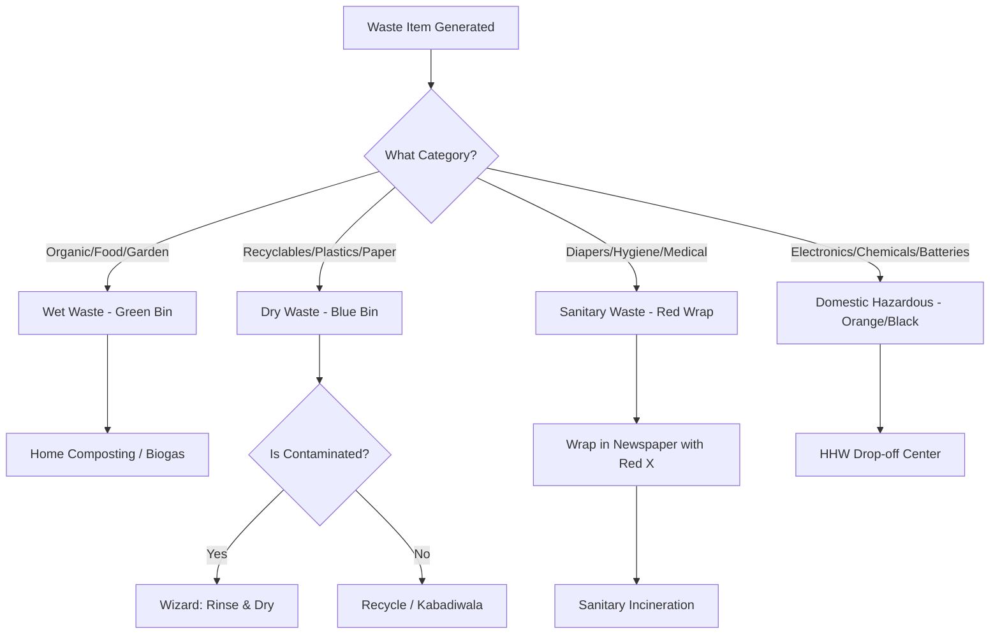
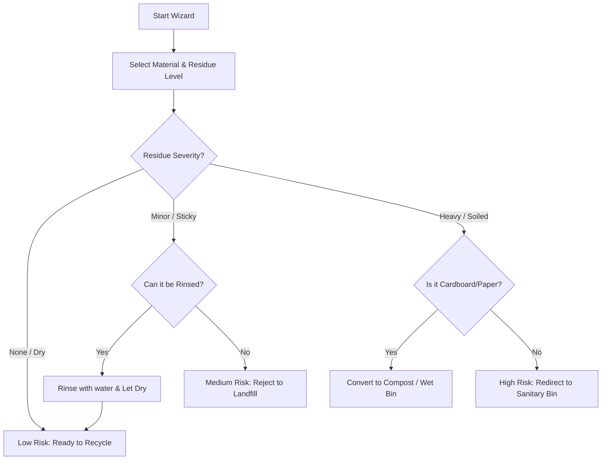
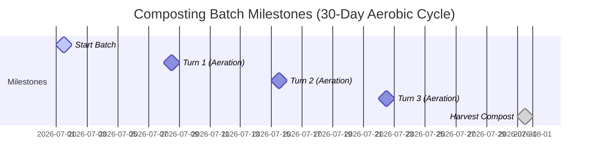

# EcoSort India - Swachh Waste Segregation AI Agent



An interactive, responsive, and mobile-friendly web application designed to support the **Swachh Bharat Mission** and align with the **Solid Waste Management (SWM) Rules 2016**. EcoSort India guides sanitation workers, housing societies, and households in proper 4-way waste segregation, regional municipal compliance, and localized composting.

---

## 🌟 Key Features

1. **Swachh Bot AI Chat Assistant**:
   - Classifies over **100+ localized Indian waste items** (e.g., *tender coconut shell, Amul milk packet, pooja flowers, used diapers, clay kulhads, expired medicines*).
   - Recommends scrap value recovery strategies, suggesting when to bundle and sell dry items (cardboard, paper, metal) to local **Kabadiwalas (scrap dealers)**.
2. **Dry Waste Contamination Wizard**:
   - Evaluates recyclables based on material, residual foods, attachments, and washing pre-treatments.
   - Calculates a contamination score (0–100) and supplies a step-by-step cleaning guide.
3. **15-City Segregation Comparison Grid**:
   - Compare municipal rules across 15 major corporations, including:
     - *Bengaluru (BBMP)*, *Mumbai (BMC)*, *Indore (IMC)*, *Delhi (MCD)*, *Chennai (GCC)*, *Kolkata (KMC)*, *Hyderabad (GHMC)*, *Pune (PMC)*, *Ahmedabad (AMC)*, *Lucknow (LMC)*.
     - Punjab Cities: *Ludhiana (LMC)*, *Amritsar (AMC)*, *Jalandhar (JMC)*, *Patiala (PMC)*, *Bathinda (BMC)*.
4. **Interactive Collection Hub Locator**:
   - Search by postal PIN code (e.g., `560001` for Bengaluru, `400001` for Mumbai, `143001` for Amritsar) to load mock local recycling centers, hours, and maps.
5. **Composting Cycle Calendar**:
   - Schedule and monitor domestic organic wet waste batches across **Aerobic Bin**, **Bokashi**, and **Backyard Pit** methods. Shows turning alerts and harvest schedules.
6. **Advanced Analytics Dashboard**:
   - A dynamic, interactive SVG chart tracking weekly waste stream trends (Dry, Wet, Sanitary, Hazardous) in kilograms.
7. **Swachh Sorting Mini-Game**:
   - Drag-and-drop or select bins to sort waste items. Earn Swachh points and unlock badges like *Green Streak* and *Swachh Hero*.
8. **Progressive Web App (PWA) Offline Support**:
   - Register service workers and manifests to support offline operations for waste collectors on-the-go.

---

## 📊 Visual Workflows

### 1. General Waste Segregation Flow
The following diagram illustrates how waste items are processed and directed into standard municipal containers:



### 2. Contamination Check Decision Tree
How the Contamination Wizard evaluates if dry waste is suitable for the recycling bin:



### 3. Composting Cycle Timeline (Aerobic Method)
The tracking milestones automatically populated inside the calendar:



---

## 🛠️ Installation & Local Running

1. **Clone the repository**:
   ```bash
   git clone https://github.com/<your-username>/ecosort-india.git
   cd ecosort-india
   ```
2. **Run locally using Python's built-in server**:
   ```bash
   python -m http.server 8080
   ```
3. Open your web browser and navigate to: **`http://localhost:8080`**

---

## 📱 Progressive Web App (PWA) Setup
This app includes a Service Worker (`sw.js`) and a Web Manifest (`manifest.json`). 
- When hosted on an HTTPS server, it can be installed on mobile phones and desktop computers.
- Caches all layout and database assets, enabling sanitation workers to search rules offline without active cell service.
